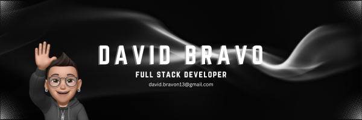

## ¡Hola! Soy David 👋

  

Soy **Desarrollador Full Stack** con más de 2 años de experiencia creando soluciones escalables y bien estructuradas.

Me especializo en **backend con Node.js, Express y NestJS**, y tengo experiencia en **Docker** y despliegues con **AWS**.  
También trabajo en el frontend con **React, Next.js, Tailwind y TypeScript** para crear productos completos de principio a fin.

Siempre estoy aprendiendo y buscando desafíos que me permitan crecer y aportar valor. 🚀

## 🧠 Tecnologías y Herramientas Conocidas

Estas son algunas de las tecnologías con las que he trabajado o tengo experiencia:

### Lenguajes de Programación

### Desarrollo Frontend

### Backend y DevOps

### Bases de Datos

### Herramientas y Otros

## 📬 Contáctame

¿Tienes alguna idea, proyecto o simplemente quieres charlar un rato? Aquí me puedes encontrar:

- **Email**: david.bravon13@gmail.com
- **LinkedIn**: [Mi perfil](https://www.linkedin.com/in/david-bravo-a67922226)
- **GitHub**: [Mi repositorio](https://github.com/dbravo13)
